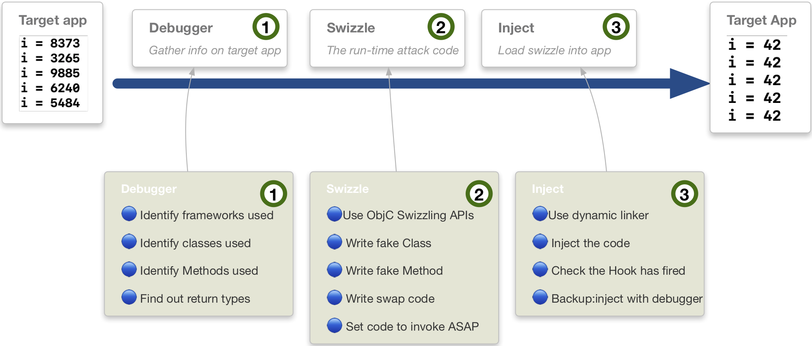
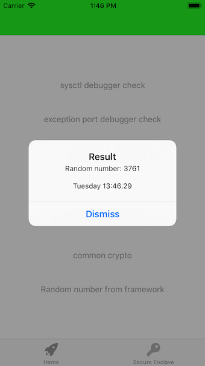
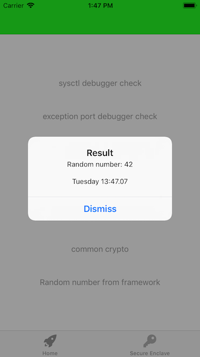

# iOS Debugger Challenge


This iOS app was written to practice the following techniques:

- **Challenge 1: Bypass anti-debug (ptrace)**

- **Challenge 2: Bypass anti-debug (sysctl)**

- **Challenge 3: hook Apple's Random String function**

- **Challenge 4: read encryption key and algorithm**

- **Challenge 5: Bypass anti-debug (exception ports)**

- **Challenge 6: Method Swizzling**

- **Challenge 7: Secure Enclave key generation**

## Challenge 1: Bypass anti-debug (ptrace)

Using `ptrace` on `iOS` was a commonly discussed technique to stop a debugger attaching to your iOS app.  If you tried to attach a debugger AFTER  a *deny_attach* was issued, you would see something like this...
```
(lldb) process attach --pid 93791
error: attach failed: lost connection
```
If you attached a debugger before ptrace *deny_attach*  was set, you would see a process crash.

The header files for ptrace were not easily available on iOS, unlike macOS.  But you could still start a *deny_attach* on iOS.  


##### Bypass steps
Get your debugger ready:
```
process attach --pid 96441                // attach to process
rb ptrace -s libsystem_kernel.dylib       // set a regex breakpoint for ptrace
continue                                  // continue after breakpoint
dis                                       // look for the syscall

NOTE - a "waitfor" instruction, is my preferred way to start a debugger
`(lldb) process attach --name "my_app" --waitfor`
```
Check where your breakpoint stopped:


Return an integer 0, to sidestep the real `ptrace` result.
```
(lldb) thread return 0
```
### Challenge 1 - COMPLETE


## Challenge 2: Bypass anti-debug (sysctl)
Sysctl was the [Apple_recommended_debug_detect][a3a00022] way to check if a debugger was attached to your app.

  [a3a00022]: https://developer.apple.com/library/archive/qa/qa1361/index.html "apple_link"

**The same trick for Challenge 1 (ptrace) worked with sysctl**. But I wanted to be more creative.  I was inspired by https://github.com/DerekSelander/LLDB to create a new, empty Swift framework that loaded a C function API named - you guessed it -`sysctl`.  That was injected into my app's process image list.

##### Create an empty Swift framework
I created an empty Swift project.  I added the following C code.  You don't need a C header file.

##### Write your fake sysctl API
```
int sysctl(int * mib, u_int byte_size, void *info, size_t *size, void *temp, size_t(f)){

    static void *handle;
    static void *real_sysctl;
    static int fake_result = 0;

    static dispatch_once_t onceToken;
    dispatch_once(&onceToken, ^{  // ensure this is only called once & not on every function call
        handle = dlopen("/usr/lib/system/libsystem_c.dylib", RTLD_NOW);
        real_sysctl = dlsym(handle, "sysctl");  // get function pointer
    });

    printf("Real sysctl function: %p\nFake sysctl: %p\n", real_sysctl, sysctl);
    printf("HOOKED SYSCTL");
    return fake_result;
}
```
##### Use LLDB to load your hooking framework
```
(lldb) image list -b rusty_bypass
error: no modules found that match 'rusty_bypass'
```
##### Load dylib from Mac into device
Now load the process...
```
(lldb) process load /Users/PATH_TO_FRAMEWORK/rusty_bypass.framework/rusty_bypass
Loading "/Users/PATH_TO_FRAMEWORK/rusty_bypass.framework/rusty_bypass"...ok
Image 0 loaded.

(lldb) image lookup -s sysctl           // shows a great view of where the API is invoked
```
##### dlopen and dlsym
Find the load address for the `sysctl` function inside the iOS app.

##### Find the load addresses for C API sysctl() in the symbol table
```
(lldb) expression (void*)dlopen("/usr/lib/system/libsystem_c.dylib",0x2)
(void *) $2 = 0x000000010e7086e0
(lldb) expression (void*)dlsym($2,"sysctl")
(void *) $3 = 0x0000000113be7c04
```
Ok, now check my address of my bypass...
```
(lldb) expression (void*)dlopen("/Users/..../rusty_bypass.framework/rusty_bypass",0x2)
(lldb) ) $4 = 0x0000604000133ec0
(lldb) expression (void*)dlsym($4,"sysctl")
(void *) $5 = 0x000000012e292dc0
```
##### Challenge 2 - failed on first attempt....
Now the `rusty_bypass` framework was loaded, I half expected it to work.  No.  the libsystem_kernel `sysctl` was called before my own code.
##### Symbol table to the rescue
```
(lldb) image dump symtab -m libsystem_c.dylib
Now check your Load Address:  0x0000000113be7c04  for `sysctl`
```
##### Verify what you found, the easy way
```
(lldb) image dump symtab -m rusty_bypass`
Now check your Load Address.  `0x000000012e292dc0` for `sysctl`
```
##### Set a breakpoint
```
(lldb) b 0x0000000113be7c04           
(lldb) register read
```
##### Whoop whoop
This was the killer step. The fruits of labor...
```
General Purpose Registers:
       rax = 0x000000000000028e
        .....
        .....
        .....
       rip = 0x0000000113be7c04  libsystem_c.dylib sysctl
```
##### Change load address of API call
```
(lldb) register write rip 0x000000012e292dc0
rip = 0x000000012e292dc0  rusty_bypass`sysctl at hook_debugger_check.c:5
(lldb) continue
```
### Challenge 2 - COMPLETE

##### Bonus - use lldb to print when inside your fake sysctl API
I wanted to check I was inside of my hooked-sysctl.  I could have added `syslog` statements to achieve the same.  But that missed the point of improving my lldb skills.  Here was a more fun way...
```
(lldb) breakpoint set -p "return" -f hook_debugger_check.c
(lldb) breakpoint modify --auto-continue 1
(lldb) breakpoint command add 1
  script print "hello”
  DONE
(lldb) continue
```
## Challenge 3: hook Apple's Random String function
I started with some simple Swift code.  Could I whiten the UUID to a value I predefined?
```
@IBAction func random_string_btn(_ sender: Any) {
    let randomString = NSUUID().uuidString
    present_alert_controller(user_message: "Random string: \(randomString)")
}
```

##### Use lldb to find the API
```
(lldb) image lookup -rn uuidString
<nothing returned >

(lldb) lookup NSUUID -m Foundation
****************************************************
14 hits in: Foundation
****************************************************
-[NSUUID init]
-[NSUUID hash]
+[NSUUID UUID]

```
Although the API was called via Swift, it was an Objective-C Class.I  attached `frida` to learn more.
```
[iPhone::Debug CrackMe]-> ObjC.classes.NSUUID.UUID().toString();
"6C402B55-6AFC-494A-B976-BCA781801A0A"
```
You could invoke the class with lldb:
```
(lldb) po [NSUUID UUID]
<__NSConcreteUUID 0x6000006374a0> 6BC8E049-2EFD-4BAA-B2AB-456E69AC74F8

(lldb) po [NSUUID UUID]
<__NSConcreteUUID 0x60400043fbc0> A41E59A5-C7C6-470F-88ED-48130BD85D1F
```
This was interesting.  Every time you called that `static method` it would add the pointer to the heap.  They were not deallocated.   Perhaps this was a way to ensure a repeated GUID was never given?

A disassemble revealed some interesting elements.
```
(lldb) disassemble -n "+[NSUUID UUID]" -c10
```
If you move to the init call - in the asm code, the 32-byte field was set to zeros.
```
(lldb) po (char*) $rax
<__NSConcreteUUID 0x6040006234a0> 00000000-0000-0000-0000-000000000000
```
##### Failed on first attempt....
It appeared you could not trust the return register.  As it did not match what Swift presented to the user.

##### failed on 2nd, 3rd, 4th, n attempts
```
frida-trace -m "*[NSUUID **]" -U -f funky-chicken.debugger-challenge

Instrumenting 27 functions.
```
The 4 I cared about were as follows:
```
+[NSUUID UUID]:
-[NSUUID init]:
-[NSUUID UUIDString]:
-[__NSConcreteUUID UUIDString]:
```
`Frida-Trace` generated a javascript file template when the above command ran.  I changed the javascript code to:
```
  onLeave: function (log, retval, state) {
     var message = ObjC.Object(retval);
     log("[+][__NSConcreteUUID UUIDString] -->\n\"" + message.toString() + "\"");
  }
```
### Challenge 3 - FAILED
Something was odd about this API.  It generated multiple UUID's every time you called the API.  But with Frida or lldb I could never find the actual return value going back to the swift code which was simply:
```
let randomString = UUID()
print(randomString.uuidString)
```

## Challenge 4: read encryption key and algorithm
I added a popular `RNCryptor` wrapper around Apple's CommonCrypto library.  I statically embedded this into the Debugger Challenge instead of adding as a CocoaPod.

The CommonCrypto API `CCCryptorCreate init` was the target.  It was invoked behind this Swift code that called into the `RNCryptor.encrypt` API:

```
    // Encrypt
    let myString = "Ewoks don't wear pyjamas."
    let myData = myString.data(using: String.Encoding.utf8)! as Data  // note, not using NSData
    let password = "AAAAAAAA" // eight 0x41 values in hex
    let ciphertext = RNCryptor.encrypt(data: myData, withPassword: password)
```
##### Leveraging Frida-Trace
```
frida-trace -i "CCCryptorCreate*" -U "Debug CrackMe"
```


Out of the box, this tells you interesting information.

Trace  | RNCryptor Definition  
--|--
op=0x0  |  Encrypt
alg=0x0  |  kCCAlgorithmAES128
options=0x1 |  kCCOptionPKCS7Padding
keyLength=0x20  |  kCCKeySizeAES256 = 32 (0x20 in hex)
key  |  A pointer to the Binary key (Data encoded)
iv  |  A pointer to the Binary I.V. (Data encoded)
cryptorRef  |  Opaque reference to a CCCryptor object

##### Watch the encryption key with a Frida-Script
```
/* Usage:   frida -U "Debug CrackMe" -l cc_hook.js --no-pause */

console.log("[+] script started...")
if (ObjC.available)
{
  if (Process.isDebuggerAttached() == true)
  {
    console.log("[+] Debugger attached, in addition to Frida.");
  }
  var a = Process.arch.toString()
  console.log("[+] Device chip: " + a);

  var f = Module.findExportByName("libcommonCrypto.dylib","CCCryptorCreate");

  if (f){
      console.log("[+] Found common crypto: " + f);
      Interceptor.attach(f, {
          onEnter: function (args) {
              console.log("inside init statement for CCCryptorCreate. Key, IV and algorithm available");
          }
      });
  }
}
else
{
    console.log("[+] Objective-C Runtime not available!");
}
console.log("[+] ...script completed")
```
##### Where is the plaintext about to be encrypted?
If you look at http://www.manpagez.com/man/3/CCCryptorCreate/ this API will lead to the Encryption Key.  But what if I want the actual plaintext that is being encrypted?  You can use lldb to show the lifecycle of the CommonCrypto API calls.  The flow is the same for encrypt and decrypt.  
```
(lldb) rb CCCrypt
```
- [ ] CCCryptorCreate
- [ ] CCCryptorCreateWithMode
- [ ] CCCryptorGetOutputLength
- [ ] CCCryptorUpdate
- [ ] CCCryptorGetOutputLength
- [ ] CCCryptorFinal
- [ ] CCCryptorRelease

The man page tells you the plaintext is sent into this API:
```
CCCryptorUpdate(CCCryptorRef cryptorRef, const void *dataIn,
         size_t dataInLength, void *dataOut, size_t dataOutAvailable,
         size_t *dataOutMoved);
```
Now we have our target - argument 2 - let's use lldb to reveal the plaintext.

RDI - first arg, **RSI - second arg**, RCX - fourth arg


```
lldb) rb CCCryptorUpdate
Breakpoint 1: where = libcommonCrypto.dylib`CCCryptorUpdate, address = 0x000000010b91092c
(lldb) c
Process 11315 resuming

(lldb) register read
General Purpose Registers:
       rsi = 0x000060400044a2a0

Note ->  RSI can be access via $arg2 in lldb
(lldb) po (char*) $arg2
"Ewoks don't wear pyjamas."

(lldb) memory read 0x000060400044a2a0
0x60400044a2a0: 45 77 6f 6b 73 20 64 6f 6e 27 74 20 77 65 61 72  Ewoks don't wear
0x60400044a2b0: 20 70 79 6a 61 6d 61 73 2e 00 00 00 00 00 00 00   pyjamas........
```
##### What is the decrypted plaintext?
```
(lldb) b CCCryptorFinal
(lldb) c
(lldb) po (char*) $arg2
(lldb) po (char*) $rsi
(lldb) mem read 0x00006040000106a0 -c10
```
Sometimes, the decrypted text was not together.  I had an assumption this related to the C `Malloc` API - that was used the hood by CommonCrypto.  `Malloc` was not always given sequential blocks of memory from the O/S.
### Challenge 4 - failed to get raw key
```
(lldb) rb CCCryptorCreateWithMode
Breakpoint 1: where = libcommonCrypto.dylib`CCCryptorCreateWithMode, address = 0x00000001826c8474
(lldb) rb CCCryptorCreateWithMode

API definition from Apple:
CCCryptorCreateWithMode(op, mode, alg, padding, iv, key, keyLength, tweak, tweakLength, numRounds, modeOptions, cryptorRef);

To get the Key Length.....
(lldb) po (size_t) $arg7
32  // 256 bit key

To get the raw key...
(lldb) memory read -s4 -fx -c32 $arg6
<< never get an understandble key, in here. >>
```

### Challenge 4 - COMPLETE
Using the CCCryptorCreate API spec, we can see which arguments to read.
```
CCCryptorCreate(CCOperation op, CCAlgorithm alg, CCOptions options,
         const void *key, size_t keyLength, const void *iv,
         CCCryptorRef *cryptorRef);
```
With a pre-defined key 16 byte key (128 bits), I can read it with the following debugger commands.
```
(lldb) b CCCryptorCreate
Breakpoint 1: where = libcommonCrypto.dylib`CCCryptorCreate, address = 0x000000010a6d51b7

(lldb) reg read $arg4
     rcx = 0x000060800003a590

(lldb) mem read 0x000060800003a590
0x60800003a590: 41 41 41 41 41 41 41 41 41 41 41 41 41 41 41 41  AAAAAAAAAAAAAAAA

(lldb) memory read -s16 -fC $arg4
0x60800003a590: AAAAAAAAAAAAAAAA

(lldb) memory read -s16 -fx -c1 $arg4
0x60800003a590: 0x41414141414141414141414141414141
```
If you read the Initialization vector, lldb cannot display a lot of the characters.  That is because the code callinto into the API `SecRandomCopyBytes` which gives a lot of extended / non-Ascii characters.  You can still read it by forcing it to print in hex.
```
(lldb) mem read -s1 -fx $arg6
0x6080002668c0: 0x46 0xbc 0x72 0xc9 0x04 0xfb 0xb5 0xd6
```

### Useful references
```
https://richardwarrender.com/2016/04/encrypt-data-using-aes-and-256-bit-keys/
https://stackoverflow.com/questions/25754147/issue-using-cccrypt-commoncrypt-in-swift
```
## Challenge 5: exception ports
Another anti-debug technique on macOS was to check if a debugger was attached by looking if any of the Ports used by a Debugger returned a valid response.  This relied on the C `task_get_exception_ports` API.  You passed in the Exception Port you wanted - in argument 2 (the RSI register).  

### Challenge 5 - COMPLETE
Thanks to: https://alexomara.com/blog/defeating-anti-debug-techniques-macos-mach-exception-ports/.  Set the Exception Ports to check to a null value.  
```
(lldb) b task_get_exception_ports
Breakpoint 3: where = libsystem_kernel.dylib`task_get_exception_ports, address = 0x00007fff6a530675
(lldb) c
Process 48185 resuming
(lldb) p $arg2
(unsigned long) $0 = 66
(lldb) reg w rsi 0
(lldb) c
Process 48185 resuming
No debugger detected
```
### Useful references
```
http://web.mit.edu/darwin/src/modules/xnu/osfmk/man/task_get_exception_ports.html
https://zgcoder.net/ramblings/osx-debugger-detection.html
https://github.com/apple/darwin-xnu/blob/master/osfmk/mach/exception_types.h
```
## Challenge 6: Method Swizzling
Why `Swizzle`? If you understand `swizzling` you understand part of `Objective-C's` beauty. Read this from [Apple][20e2b71f]
:

  [20e2b71f]: https://developer.apple.com/library/archive/documentation/Cocoa/Conceptual/ObjCRuntimeGuide/Introduction/Introduction.html#//apple_ref/doc/uid/TP40008048-CH1-SW1 "apple_article"

> The Objective-C language defers as many decisions as it can from compile time and link time to runtime. Whenever possible, it does things dynamically.

My goal was to `method swizzle`.  I wanted to swap out a real `random` value with a value that I had chosen (`42`), as the below picture describes:



### Challenge 6 - COMPLETE
**Step 1**, I used a debugger to find information on my target.
```
(lldb) dclass -m YDObjCFramework
Dumping classes
************************************************************
YDHelloClass

(lldb) methods YDHelloClass
<YDHelloClass: 0x10ef63128>:
in YDHelloClass:
	Class Methods:
		+ (void) sayStaticHello; (0x10ef62ec0)
	Instance Methods:
		- (long) getRandomNumber; (0x10ef62e90)
(NSObject ...)

(lldb) exp import YDObjCFramework

(lldb) exp let $a = YDHelloClass()

(lldb) exp $a.getRandomNumber()
(Int) $R4 = 7981
(lldb) exp $a.getRandomNumber()
(Int) $R6 = 1021
(lldb) exp $a.getRandomNumber()
(Int) $R8 = 1614
```
**Step 2**, I needed to write my swizzle code that would target the following information:
```
Class = YDHelloClass
Instance Method = getRandomNumber
```
I went back to `xCode` and selected `New\Project\iOS\Framework\Objective-C`.  Using Objective-C `runtime` APIs, I placed the hook:
```
#import <Foundation/Foundation.h>
#import <objc/message.h>

@interface YDGoodbyeClass: NSObject
- (NSInteger)fakeRandomNumber;
@end

@implementation YDGoodbyeClass

- (NSInteger)fakeRandomNumber
{

    if ([self respondsToSelector:@selector(fakeRandomNumber)]) {
        NSInteger result = [self fakeRandomNumber];
        NSLog(@"[+] 🍭 swizzled.Original return value: %ld", result);
    }
    else {
        NSLog(@"[+] 🍭 swizzled.");
    }

    return 42;
}

+ (void)load
{
    Class targetClass = objc_getClass("YDHelloClass");

    if (targetClass != nil) {
        NSLog(@"[+] 🎣 Found YDHelloClass\n");
        NSLog(@"[+] 🎣 Placing hook on getRandomNumber\n");
        Class orignalClass = objc_getClass("YDHelloClass");
        Method original, swizzled;
        original = class_getInstanceMethod(orignalClass, @selector(getRandomNumber));
        swizzled = class_getInstanceMethod(self, @selector(fakeRandomNumber));
        method_exchangeImplementations(original, swizzled);
    }
}

@end
```
**Step 3**, as I didn't have my `jailbroken` iOS device handy, I could not use the `dynamic library loader` to invoke this code.  Instead, I used my trusty debugger:
```
lldb) process load /Users/.../swizzle_framework.framework/swizzle_framework
[+] 🎣 Found YDHelloClass

Loading "/Users/.../swizzle_framework.framework/swizzle_framework"...ok
Image 0 loaded.
```
That was it.  



## Challenge 7: Secure Enclave key generation
I generated a Elliptic Curve key pair, inside the Secure Enclave.  The Key was set to allow both `Encrypt` and `Sign` functionality.
