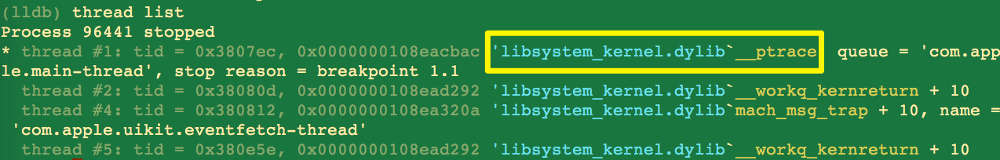
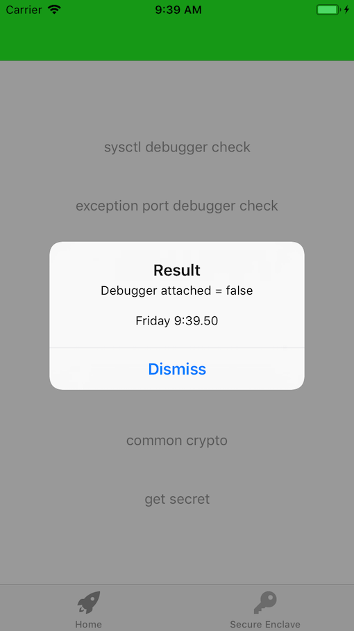
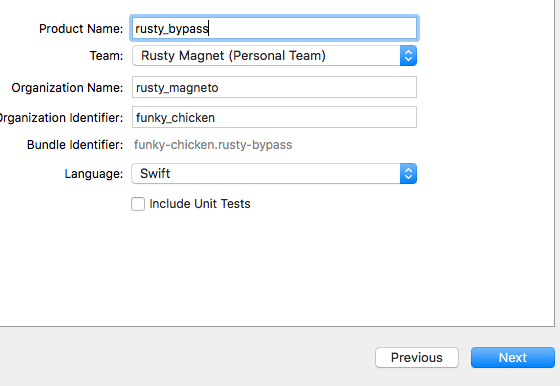
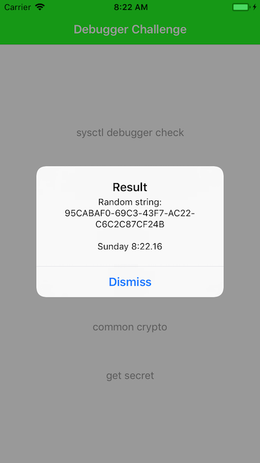
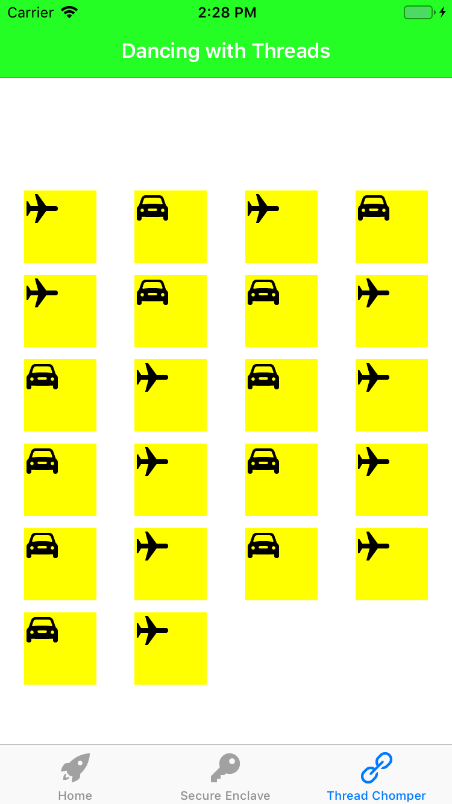
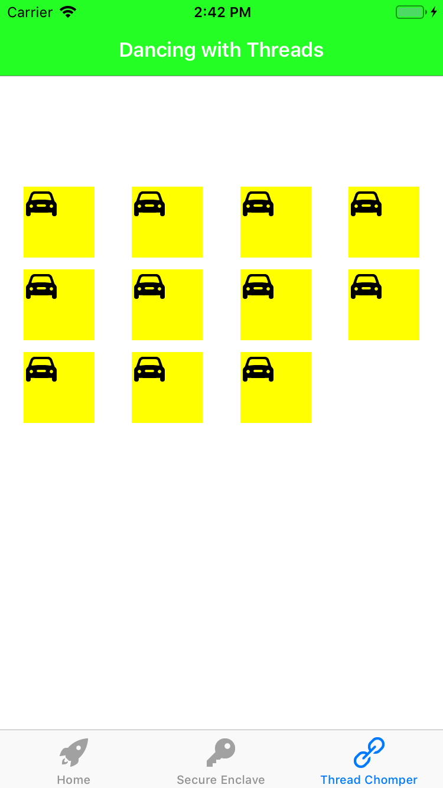
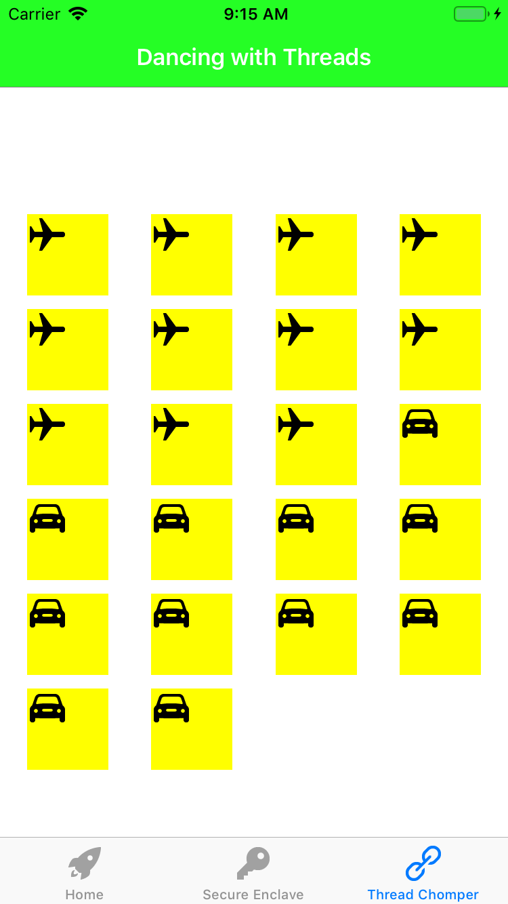
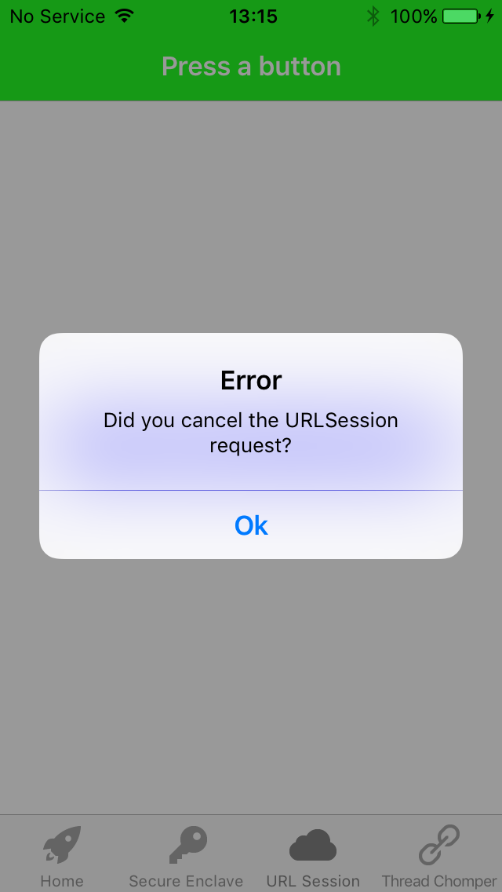
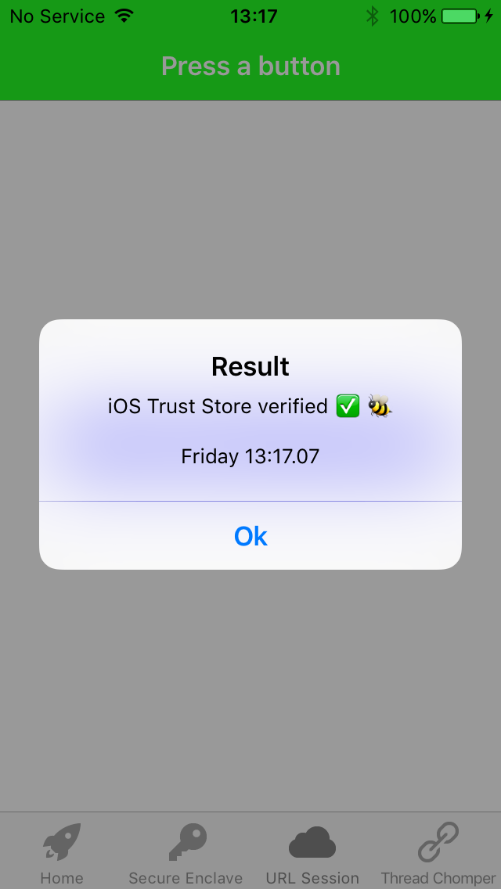
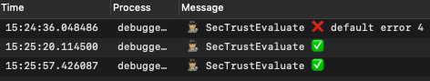

# iOS Debugger Challenge

  

<!-- TOC depthFrom:2 depthTo:2 withLinks:1 updateOnSave:1 orderedList:0 -->

- [Challenge: Bypass anti-Frida check ( thread names )](#challenge-bypass-anti-frida-check-thread-names-)
- [Challenge: Understand Jailbreak detections](#challenge-understand-jailbreak-detections)
- [Challenge: Method Swizzling on non-jailbroken device](#challenge-method-swizzling-on-non-jailbroken-device)
- [Challenge: Bypass anti-debug (ptrace)](#challenge-bypass-anti-debug-ptrace)
- [Challenge: Bypass ptrace (asm Syscall)](#challenge-bypass-ptrace-asm-syscall)
- [Challenge: Bypass anti-debug (sysctl)](#challenge-bypass-anti-debug-sysctl)
- [Challenge: Bypass anti-debug ( sysctl, more advanced )](#challenge-bypass-anti-debug-sysctl-more-advanced-)
- [Challenge: Bypass anti-debug (Exception Ports)](#challenge-bypass-anti-debug-exception-ports)
- [Challenge: Hook Apple's Random String function](#challenge-hook-apples-random-string-function)
- [Challenge: Find Encryption key](#challenge-find-encryption-key)
- [Challenge: Dancing with Threads](#challenge-dancing-with-threads)
- [Challenge: Certificate Pinning bypass ( with Frida )](#challenge-certificate-pinning-bypass-with-frida-)
- [Challenge: Certificate Pinning bypass ( with Method Swizzle )](#challenge-certificate-pinning-bypass-with-method-swizzle-)
- [Challenge: Adding Entitlements](#challenge-adding-entitlements)

<!-- /TOC -->

## Challenge: Bypass anti-Frida check ( thread names )

#### Running Frida on a Clean device

Since `Frida version ~12.7` it is super simple to run on any iOS device.  Why is it so good?

- No need to `repackage` the iOS app.
- No requirement for a `Jailbroken` device.

#### Setup Frida-Gadget

1. Get `Frida-Gadget` for iOS from https://github.com/frida/frida/releases
2. Copy file to new folder: `cp frida-gadget.dylib ~/.cache/frida/gadget-ios.dylib`

#### Run frida or frida-trace

With a Jailed device from the command line:

```bash
frida -U -f funky-chicken.debugger-challenge --no-pause							// frida-gadget. The --no-pause flags means the app loads as normal, after Frida is injected
frida-trace -U -f funky-chicken.debugger-challenge									// frida-trace
```

#### Get all Named Threads

How do you get all the `Thread Names` with `iOS`?  

`NSThread` gets you the `main thread` and `currentThread`.  What about `threads` - like `Frida threads` - that you did not start?  An answer is defined inside of `#include <mach/mach.h>`.  You ask the `Kernel` for a Thread List.  

`task_threads()` gives you all the `threads` inside of `app's process`.  After that, you call `pthread_from_mach_thread_np()` to converts the `mach thread ID` to `pthreads ID`.  Then `pthread_getname_np()` to get the thread name.

#### Run Frida-Gadget

Now get your clean device. Make sure `frida` is installed on your host machine.   Just connect via USB:


That got us `Frida` related Thread names. The detection worked.

#### Selecting a bypass

There are lots of ways to stop this check of `Thread Names` working.  I liked the idea to `force fail` the `Kernel's` response, when it got a request for a `Thread List`.  That way, I could re-use the same bypass script on other code that called into the `Kernel`.

In short, I would write a `Frida` script that is executed when the app starts.  It will patch the variable named `kr`:

```c
kern_return_t kr = task_threads (this_task, &thread_list, &thread_count);
if (kr != KERN_SUCCESS) {
	// handle the error.
}
```

There were over 50 error codes returned from the `kernal`.  The return code was passed back as a `kern_return_t` type.  `kern_return_t` was just an integer: `typedef int kern_return_t;`.

```c
#include <mach/machine/kern_return.h>
	#define KERN_SUCCESS                    0
	#define KERN_INVALID_ADDRESS            1
	#define KERN_PROTECTION_FAILURE         2
	#define KERN_NO_SPACE                   3
	#define KERN_INVALID_ARGUMENT           4
	......
	....
	...
```

#### Avoiding crashes

I didn't want the bypass to disrupt other code.  Let's check if `task_threads` is called by anybody else on my clean device:

```bash
frida-trace -i "task_threads" -U -f funky-chicken.debugger-challenge
Instrumenting functions...                                              
task_threads: Loaded handler at "/.../__handlers__/libperfcheck.dylib/task_threads.js"
Started tracing 1 function. Press Ctrl+C to stop.                       
           /* TID 0x407 */
  7387 ms  task_threads()
```

Ok. The calls to this api were isolated to the `Frida` detection only.  Good news.

#### Double check work

I was not expecting `task_threads()` to be inside of `libperfcheck.dylib`.  I was expecting it to be inside of `libsystem_kernel.dylib`.

Let's double-check with `Frida`:

```bash
frida -U -f funky-chicken.debugger-challenge --no-pause -q --eval 'var x={};Process.enumerateModulesSync().forEach(function(m){x[m.name] = Module.enumerateExportsSync(m.name)});' | | grep -B 1 -A 1 task_threads

            "address": "0x1c1c4645c",
            "name": "task_threads",
            "type": "function"
```

Now search for the `Module`, with the `Exports' Address`

```bash
frida -U -f funky-chicken.debugger-challenge --no-pause -q --eval 'var x={};Process.findModuleByAddress("0x1c1c4645c");'

{
    "base": "0x1c1c2a000",
    "name": "libsystem_kernel.dylib",
    "path": "/usr/lib/system/libsystem_kernel.dylib",
    "size": 200704
}
```

#### Writing a Frida Interceptor Script

Now, we can to write a script.  We will invoke it with the `-l` flag:

`frida -l task_thread.js -U -f funky-chicken.debugger-challenge --no-pause`

Below is our `task_threads.js` script:

```javascript
const module_name = "libsystem_kernel.dylib";
const exp_name = "task_threads";

function prettyExportDetail(message) {
    return '[*]' + message + '\t' + exp_name + '()\tinside: ' + module_name;
}

if (ObjC.available) {
    console.log("[*]Frida running. ObjC API available!");
    try {
        const ptrToExport = Module.findExportByName(module_name, exp_name);
        if (!ptrToExport) {
            throw new Error(prettyExportDetail('Cannot find Export:'));
        }
        console.log(prettyExportDetail('Pointer to'));

        Interceptor.attach(ptrToExport, {
            onEnter: function (args) {
                console.log(prettyExportDetail('onEnter() interceptor ->'));
                this._threadCountPointer = new NativePointer(args[2]);
                console.log('[*]Address of Thread Count:' + this._threadCountPointer );
            },

            onLeave: function (retValue) {
                this._patchInt = 4
                console.log(JSON.stringify({
                    return_value: retValue,
                    patched_return_value: this._patchInt,
                    function: exp_name,
                    thread_count: this._threadCountPointer.readPointer().toInt32()
                }));
                retValue.replace(this._patchInt)
            }
        });
    }
    catch(err){
        console.error(err.message);
    }
}
else {
    console.log("[!]Objective-C Runtime is not available!");
}
```

### Complete

The bypass works.  


Now, the code, stops checking for `Frida` with `Named Threads` because it got a `kern_return_t` code that it was not able to digest.

```bash
Spawned `funky-chicken.debugger-challenge`. Resuming main thread!       
[*]onEnter() interceptor ->	task_threads()	inside: libsystem_kernel.dylib
[*]Address of Thread Count:0x16f5811d4
{"return_value":"0x0","patched_return_value":4,"function":"task_threads","thread_count":15}
```

## Challenge: Understand Jailbreak detections

#### Writing Jailbreak detections

Writing a self-built Jailbreak detection is tempting.  But there are elegant libraries available to detect `Elevated Privilege`.  Check out an open-source Swift version: <https://github.com/securing/IOSSecuritySuite>.

```swift
if IOSSecuritySuite.amIJailbroken() {
	print("This device is jailbroken")
} else {
	print("This device is not jailbroken")
}
```

Most of the libraries have a `true/false` response, at a high-level.  But what happens if Apple change an API?  What happens if ARM change something?  What happens if a detection fails or is forced to fail?  You hit two common problem in Security;`false positives` and a `fail close / fail open policy`.

A third party library can probably give you the `Jailbreak == true/false` plus a confidence level whether stuff failed or it was a definite jailbreak.

```swift
static func amIJailbrokenWithFailedChecks() -> (jailbroken: Bool, failedChecks: [FailedCheck]) {
    let status = performChecks()
    return (!status.passed, status.failedChecks)
}
```

#### Layers of detections are required

Not all jailbreaks are equal.  You need layers of code to account for this.  For example, the below code is ineffective on a device that has only has a basic jailbreak applied:

```objective-c
/* Loop through all loaded Dynamic libraries at run-time */
-(void)checkModules{
    unsigned int count = 0;
    NSArray *suspectLibraries = [[NSArray alloc] initWithObjects:
                                    @"SubstrateLoader.dylib",
                                    @"MobileSubstrate.dylib",
                                    @"TweakInject.dylib",
                                    @"CydiaSubstrate",
                                    @"cynject",
                                    nil];
```

For example, with the `Electra jailbreak` for `iOS` it could be set in two modes.  `Tweaks off`: you can `ssh` to the device, start `Frida` manually, run a `debugger`. The above code is not triggered.  `Tweaks on` will dynamically inject `TweakInject.dylib` at run-time, so the detection becomes useful.

Consider another example; it was common to test a `write` call from your app's sandbox to directory like `private`, `root` or `/`:

```objective-c
-(void)checkSandboxWrite{
	...
	..
	[stringToBeWritten writeToFile:@"/private/foobar.txt" atomically:YES encoding:NSUTF8StringEncoding error:&error];
	...
	..
```

This generated `Code=513 "You don’t have permission to save the file “foobar.txt” in the folder “private”." {Error Domain=NSPOSIXErrorDomain Code=1 "Operation not permitted"}}` on an `Electra` jailbroken device.

#### Jailbroken == YES

There are tonnes of internet articles on `patching` out a `Boolean` response to `amIJailbroken()`.  But what happens if there no `Boolean` return type to find?  There is likely to be a counter that increments when it finds evidence of Jailbreak.  That is what this challenge offers.

## Challenge: Method Swizzling on non-jailbroken device

Why `Swizzle`? If you understand `swizzling` you understand part of `Objective-C's` beauty. Read this from [Apple][20e2b71f]
:

  [20e2b71f]: https://developer.apple.com/library/archive/documentation/Cocoa/Conceptual/ObjCRuntimeGuide/Introduction/Introduction.html#//apple_ref/doc/uid/TP40008048-CH1-SW1 "apple_article"

> The Objective-C language defers as many decisions as it can from compile time and link time to runtime. Whenever possible, it does things dynamically.

My goal was to `method swizzle`.  I wanted to swap out a real `random` value with a value that I had chosen (`42`), as the below picture describes:


#### Step 1: Use a debugger to find information

```objective-c
(lldb) dclass -m YDObjCFramework
Dumping classes
************************************************************
YDHelloClass

(lldb) methods YDHelloClass
<YDHelloClass: 0x10ef63128>:
in YDHelloClass:
	Class Methods:
		+ (void) sayStaticHello; (0x10ef62ec0)
	Instance Methods:
		- (long) getRandomNumber; (0x10ef62e90)
(NSObject ...)

(lldb) exp import YDObjCFramework

(lldb) exp let $a = YDHelloClass()

(lldb) exp $a.getRandomNumber()
(Int) $R4 = 7981
(lldb) exp $a.getRandomNumber()
(Int) $R6 = 1021
(lldb) exp $a.getRandomNumber()
(Int) $R8 = 1614
```

#### Step 2: Write Swizzle code

I needed to write the code that would target the following information:

```swift
Class = YDHelloClass
Instance Method = getRandomNumber
```

I went back to `xCode` and selected `New\Project\iOS\Framework\Objective-C`.  Using Objective-C `runtime` APIs, I wrote code that would target Alice's SDK.  

```objective-c
+ (void)load
{
    Class orignalClass = objc_getClass("YDHelloClass");

    if (orignalClass != nil) {
        NSLog(@"\n[+] 🎣 Found YDHelloClass\n[+] 🎣 Placing hook on getRandomNumber\n");
        Method original, swizzled;
        original = class_getInstanceMethod(orignalClass, @selector(getRandomNumber));
        swizzled = class_getInstanceMethod(self, @selector(fakeRandomNumber));
        if(original != nil && swizzled != nil)
            method_exchangeImplementations(original, swizzled);
    }
}

@end
```

#### Step 3: Place the Swizzle

Let's start on an iOS Simulator.  I used my trusty debugger connected to the app running on an XCode simulator:

```objective-c
lldb) process load /Users/.../swizzle_framework.framework/swizzle_framework
[+] 🎣 Found YDHelloClass

  [70b2d1d9]: https://github.com/rustymagnet3000/YDObjCFramework "YDObjCFramework"

Loading "/Users/.../swizzle_framework.framework/swizzle_framework"...ok
Image 0 loaded.
```

### COMPLETE ( IOS SIMULATOR )

After applying the `method swizzle` you would always get a `42` value...


### Repackage app

The way to solve this challenge on a real iOS device depended on whether you had a _jailed_ or _jailbroken_ device.  I had a clean, _jailed iOS12_ device.  I chose to **repackage** the _debuggerChallenge.ipa_ file. This involves taking it apart, adding the `dynamic framework` that contained the _Swizzle_ code and putting the app back together.  

For more info on **repackaging apps**  read [here][5e75f6f0].

  [5e75f6f0]: https://github.com/OWASP/owasp-mstg/blob/master/Document/0x06c-Reverse-Engineering-and-Tampering.md "owasp"

#### Approach

- [x] Build and run Debugger Challenge within xCode.
- [x] Copy the `Product` (which is a folder called `DebuggerChallenge.app` from Finder).
- [x] Copy Bob's framework to the _DebuggerChallenge.app/Framework_ folder.
- [x] Insert a _load command_ with _Optool_ to the app's binary.
- [x] Put the DebuggerChallenge.app directory inside a new, empty folder named `Payload`.
- [x] Compress the `Payload` folder to `unsigned.ipa`.
- [x] Use `Applesign` to re-sign everything inside the IPA.
- [x] Use `iOS-deploy` to get the freshly signed app onto the _Jailed_ device.

It all sounded simple.  But I hit roadblocks:

#### Hiccup: OpTool

`OpTool` is a small repo that allows you to insert or remove `Load Commands`.  These commands fire when your app opens and decides what dynamically linked files to load into the process.

First, you need a local copy of `OpTool`.  You also need to ensure that you added `submodules`.  This last step tripped me up.

```bash
git clone https://github.com/alexzielenski/optool.git
Make initialize optool’s submodules:
cd optool/
git submodule update --init --recursive   
```

You tell the main app binary to load this new framework.

```bash
optool install -c load -p "@executable_path/Frameworks/YDBobSwizzle.framework/YDBobSwizzle" -t Payload/debugger_challenge.app/debugger_challenge
```

If it worked you would see..

```console
Found FAT Header
Found thin header...
Found thin header...
Inserting a LC_LOAD_DYLIB command for architecture: arm
Successfully inserted a LC_LOAD_DYLIB command for arm
Inserting a LC_LOAD_DYLIB command for architecture: arm64
Successfully inserted a LC_LOAD_DYLIB command for arm64
Writing executable to debugger_challenge.app/debugger_challenge...
```

Verify it..

```shell
jtool -arch arm64 -l Payload/debugger_challenge.app/debugger_challenge
```

#### Hiccup: Code signatures

If you forgot to `code sign` anything, you would hit obscure Apple errors when you tried to install the app on the iPhone.

```ssh
applesign -7 -i <DEVELOPER CODE SIGNING ID> -m embedded.mobileprovision unsigned.ipa -o ready.ipa
ios-deploy -b ready.ipa
ios-deploy -b debugger_challenge.app
No code signature found. AMDeviceSecureInstallApplication(0, device, url, options, install_callback, 0)
```

#### Hiccup: Entitlements

```ssh
ios-deploy -b debugger_challenge.app
The executable was signed with invalid entitlements.
```

What had gone wrong, when I code signed the IPA? Check the file the `provisioning file`  you passed to Applesign.

`security cms -D -i embedded.mobileprovision`

Expiry date, device ID were good. Had I chosen the wrong developer Code Signing ID?

```xml
<key>Entitlements</key>
<key>ExpirationDate</key>
	<date>2019-05-21T11:01:06Z</date>
<key>ProvisionedDevices</key>
	<string>0ec8227a5f623d0f4f6d257438730d79858a977f</string>
<key>TeamName</key>
	<string>Rusty Magnet</string>
<key>TeamIdentifier</key>
		<string>2N3CU4HVH8</string>
```

Let's try again with a new code signing ID!

```bash
security find-identity -v -p codesigning
applesign -7 -i <NEW DEVELOPER CODE SIGNING ID> -m embedded.mobileprovision debugger_chall_unsigned.ipa -o ready.ipa
```

That worked.  I could install the app on the device.

#### Hiccup 4: White screen of death

Argh.  The app won't open but it generated a crash log [] which you could get from XCode ].

```console
Exception Type:  EXC_CRASH (SIGABRT)
Exception Codes: 0x0000000000000000, 0x0000000000000000
Exception Note:  EXC_CORPSE_NOTIFY
Termination Description: DYLD, Library not loaded: @executable_path/YDBobSwizzle.dylib | Referenced from: /var/containers/Bundle/Application/3F9EDE3F-7BCF-4F25-B438-9145FD3A21B7/debugger_challenge.app/debugger_challenge | Reason: image not found
Triggered by Thread:  0
```

I had forgotten to copy the actual framework!  So I had the _Load Command_ but no code to load!

### COMPLETE ( real device )

Repeat all the above.  It worked! The Swizzle was placed and working on a `jailed` device.


## Challenge: Bypass anti-debug (ptrace)

Using `ptrace` on `iOS` is still a common technique to stop a debugger attaching to an iOS app.  If you tried to attach a debugger after `PT_DENY_ATTACH` was issued, you would see something like this...

```lldb
(lldb) process attach --pid 93791
error: attach failed: lost connection
```

If you attached a debugger before ptrace `PT_DENY_ATTACH` was set, you would see a process crash.

#### Use dtrace to observe the ptrace call

Unlike macOS, the header files for `ptrace` were not available on iOS.  But You could still `dynamically link` to the ptrace symbol at runtime on iOS.

To see this call on an iOS Simulator, run `DebuggerChallenge` and hit the `ptrace` button, after writing this command:

```objective-c
sudo dtrace -qn 'syscall::ptrace:entry { printf("%s(%d, %d, %d, %d) from %s\n", probefunc, arg0, arg1, arg2, arg3, execname); }'
// ptrace(31, 0, 0, 0) from debugger_challen
```

This will **crash** your app, if XCode is attached.

#### Bypass steps

##### attach to process

`process attach --pid 96441`

##### set a regex breakpoint for ptrace

`rb ptrace -s libsystem_kernel.dylib`

##### continue after breakpoint

`continue`

##### look for the syscall

`dis`

##### print thread list

`thread list`



##### sidestep the real result

```objective-c
(lldb) thread return 0
```

### COMPLETE



## Challenge: Bypass ptrace (asm Syscall)

If you want to make it harder to stop `ptrace` being sidestepped, you could write `inline assembly code`.  `Extended inline assembly` allows `C` language `Symbols` within the `asm` code.  

#### Bypass steps ( manual method )

```c
(lldb) image lookup -r -n Ptrace
****************************************************
1 hits in: debugger_challenge
****************************************************
+[YDDebuggerPtrace setPtraceWithASM]
```

`disassemble` that function:

```objective-c
(lldb) disas -n "+[YDDebuggerPtrace setPtraceWithASM]"
    .....
    0x104539dac <+80>:  mov    x0, #0x1a          
    0x104539db0 <+84>:  mov    x1, #0x1f
    0x104539db4 <+88>:  mov    x2, #0x0
    0x104539db8 <+92>:  mov    x3, #0x0
    0x104539dbc <+96>:  mov    x16, #0x0
    0x104539dc0 <+100>: svc    #0x1a
    .....
    ....
    ...
    ..
    .
    0x104539e0c <+176>: ret    
```

Check value of registers:

```objective-c
(lldb) p/d 0x1a
(int) $5 = 26         // syscall for ptrace on arm

(lldb) p/d 0x1f
(int) $6 = 31         // PT_DENY_ATTACH == 31
```

Set breakpoint on the `svc` call: `(lldb) b *0x104539dc0`.

### COMPLETE

When the breakpoint fires, you set the `(lldb) po $x1 = 0`.  Depending on how the code is written, that may provide an effective bypass.  That set the `x1 register` to the value `PTRACE_TRACEME`.

## Challenge: Bypass anti-debug (sysctl)

The C API, `Sysctl` was the [Apple][a3a00022] recommended way to check if a debugger was attached to your app.

  [a3a00022]: https://developer.apple.com/library/archive/qa/qa1361/index.html "apple_link"

> The sysctl utility retrieves kernel state and allows processes with appropriate privilege to set kernel tate.

To avoid repeating the `ptrace` trick, create a new, empty `Swift framework` that loaded a C function API named `sysctl`.  This code would be injected into my app's process at run-time.

#### Create an empty Swift framework

Create an empty Swift project. Add the following C code ( from Apple ).  You don't need a C header file.



#### Write your fake sysctl API

```c
int sysctl(int * mib, u_int byte_size, void *info, size_t *size, void *temp, size_t(f)){

    static void *handle;
    static void *real_sysctl;
    static int fake_result = 0;

    static dispatch_once_t onceToken;
    dispatch_once(&onceToken, ^{  // ensure this is only called once & not on every function call
        handle = dlopen("/usr/lib/system/libsystem_c.dylib", RTLD_NOW);
        real_sysctl = dlsym(handle, "sysctl");  // get actual pointer
    });

    printf("Real sysctl address: %p\nFake sysctl address: %p\n", real_sysctl, sysctl);
    printf("HOOKED SYSCTL");
    return fake_result;
}
```

#### Use LLDB to load your hooking framework

```objective-c
(lldb) image list -b rusty_bypass
error: no modules found that match 'rusty_bypass'
```

#### Load dylib from Mac into device

Now load the process...

```objective-c
(lldb) process load /Users/PATH_TO_FRAMEWORK/rusty_bypass.framework/rusty_bypass
Loading "/Users/PATH_TO_FRAMEWORK/rusty_bypass.framework/rusty_bypass"...ok
Image 0 loaded.

(lldb) image lookup -s sysctl  
```

#### dlopen and dlsym

Find the load address for the `sysctl` function inside the iOS app.

#### Find the load addresses for C API sysctl() in the symbol table

```c
(lldb) expression (void*)dlopen("/usr/lib/system/libsystem_c.dylib",0x2)
(void *) $2 = 0x000000010e7086e0
(lldb) expression (void*)dlsym($2,"sysctl")
(void *) $3 = 0x0000000113be7c04
```

Ok, now check my address of my bypass...

```c
(lldb) expression (void*)dlopen("/Users/..../rusty_bypass.framework/rusty_bypass",0x2)
(lldb) ) $4 = 0x0000604000133ec0
(lldb) expression (void*)dlsym($4,"sysctl")
(void *) $5 = 0x000000012e292dc0
```

#### Challenge - failed first attempt

Now the `rusty_bypass` framework was loaded, I half expected it to work.  No.  the libsystem_kernel `sysctl` was called before my own code.

#### Symbol table to the rescue

```c
(lldb) image dump symtab -m libsystem_c.dylib
Now check your Load Address:  0x0000000113be7c04  for `sysctl`
```

#### Verify what you found, the easy way

```c
(lldb) image lookup -a $rip
      Address: libsystem_c.dylib[0x0000000113be7c04]
      (libsystem_c.dylib.__TEXT.__text + 170512)
      Summary: libsystem_c.dylib`sysctl
```

#### Set a breakpoint

```c
(lldb) b 0x0000000113be7c04           
(lldb) register read
```

#### Whoop whoop

This was the killer step. The fruits of labor...

```c
General Purpose Registers:
       rax = 0x000000000000028e
        .....
        .....
        .....
       rip = 0x0000000113be7c04  libsystem_c.dylib sysctl
```

#### Change load address of API call

```c
(lldb) register write rip 0x000000012e292dc0
rip = 0x000000012e292dc0  rusty_bypass`sysctl at hook_debugger_check.c:5
(lldb) continue
```

### COMPLETE

This was a cumbersome way to overwrite a register. There is a much simpler and reliable way to patch out anto-debug registers at run-time.

## Challenge: Bypass anti-debug ( sysctl, more advanced )

`sysctl` asks the Kernel to detect if a process is being debugged.  The result is the `P_TRACED` flag gets set. This is defined inside of `/sys/proc.h`.  How does `sysctl` tell the Kernel which process ID it wants to check ?  Let's inspect.

```c
(lldb) b sysctl
Breakpoint 3: where = libsystem_c.dylib`sysctl, address = 0x00007fff5214c304
```

At this point, you can read what is inside the registers.

```c
sysctl(mib, sizeof(mib) / sizeof(*mib), &info, &size, NULL, 0);
```

You could read memory to understand what was passed into each register.  Is there a better simpler way ? You can use the call stack and move to frame before `sysctl`:

```c
(lldb) bt
(lldb) frame select 1
```

Now you can observe the real variable settings:

```c
(lldb) frame variable -A
(lldb) p mib
(int [4]) $14 = ([0] = 1, [1] = 14, [2] = 1, [3] = 23490)
```

Now - with the Apple documentation - we can see that the interesting value in `mib[3]` is the app's process ID.

```c
  mib[0] = CTL_KERN;
  mib[1] = KERN_PROC;
  mib[2] = KERN_PROC_PID;		/* by process id */
  mib[3] = getpid();		/* current process ID */
```

If you did want to read memory instead of using the call stack, you could:

```c
(lldb) po (int *) mib
0x00007ffee5f99610

(lldb) mem read 0x00007ffee646e610  -f d -c 4
0x7ffee5f99610: 1
0x7ffee5f99614: 14
0x7ffee5f99618: 1
0x7ffee5f9961c: 23490

```

### COMPLETE

Now we can bypass the check by patching out the value inside of `mib[3]`:

```c
(lldb) p/x 0x00007ffee646e610 + 12      // mib[3]
(long) $16 = 0x00007ffee646e61c

(lldb) po getppid()
23493

(lldb) po mib[3]=23493
23493   // overwrite the getpid() with getppid()
```

## Challenge: Bypass anti-debug (Exception Ports)

Another anti-debug technique on macOS / iOS was to check if a debugger was attached by looking if any of the `Ports` used by a Debugger returned a valid response.  

This relied on the C `task_get_exception_ports` API.  You passed in the `Exception Port` you wanted  to check.  This was always argument 2 ( `arg2`) to the function.

This was less well known tha `ptrace` or `sysctl`.  The following references were great:

```html
https://alexomara.com/blog/defeating-anti-debug-techniques-macos-mach-exception-ports/

http://web.mit.edu/darwin/src/modules/xnu/osfmk/man/task_get_exception_ports.html

https://zgcoder.net/ramblings/osx-debugger-detection.html

https://github.com/apple/darwin-xnu/blob/master/osfmk/mach/exception_types.h
```

#### Bypass steps

##### set breakpoint

```c
(lldb) b task_get_exception_ports
Breakpoint 3: where = libsystem_kernel.dylib`task_get_exception_ports, address = 0x00007fff6a530675
```

##### continue

`(lldb) c`

##### print values found by exception ports

`(lldb) p $arg2`

##### write new value

`(lldb) reg w rsi 0`

##### continue

`(lldb) c`

### COMPLETE

`No debugger detected`.

## Challenge: Hook Apple's Random String function

I started with some simple Swift code.  Could I whiten the UUID to a value I predefined?

```swift
@IBAction func random_string_btn(_ sender: Any) {
    let randomString = NSUUID().uuidString
    present_alert_controller(user_message: "Random string: \(randomString)")
}
```



#### Use debugger to find the API

```c
(lldb) image lookup -rn uuidString
<nothing returned >

(lldb) lookup NSUUID -m Foundation
****************************************************
14 hits in: Foundation
****************************************************
-[NSUUID init]
-[NSUUID hash]
+[NSUUID UUID]

```

Although the API was called via Swift, it was an Objective-C Class.I  attached `frida` to learn more.

```objective-c
[iPhone::Debug CrackMe]-> ObjC.classes.NSUUID.UUID().toString();
"6C402B55-6AFC-494A-B976-BCA781801A0A"
```

You could invoke the class with lldb:

```c
(lldb) po [NSUUID UUID]
<__NSConcreteUUID 0x6000006374a0> 6BC8E049-2EFD-4BAA-B2AB-456E69AC74F8

(lldb) po [NSUUID UUID]
<__NSConcreteUUID 0x60400043fbc0> A41E59A5-C7C6-470F-88ED-48130BD85D1F
```

This was interesting.  Every time you called that `static method` it would add the pointer to the heap.  They were not deallocated.   Perhaps this was a way to ensure a repeated GUID was never given?

A disassemble revealed some interesting elements.

```c
(lldb) disassemble -n "+[NSUUID UUID]" -c10
```

If you move to the init call - in the asm code, the 32-byte field was set to zeros.

```c
(lldb) po (char*) $rax
<__NSConcreteUUID 0x6040006234a0> 00000000-0000-0000-0000-000000000000
```

#### Failed on first attempt....

It appeared you could not trust the return register.  As it did not match what Swift presented to the user.

#### failed on 2nd, 3rd, 4th, n attempts

```c
frida-trace -m "*[NSUUID **]" -U -f funky-chicken.debugger-challenge

Instrumenting 27 functions.
```

The 4 I cared about were as follows:

```objective-c
+[NSUUID UUID]:
-[NSUUID init]:
-[NSUUID UUIDString]:
-[__NSConcreteUUID UUIDString]:
```

`Frida-Trace` generated a javascript file template when the above command ran.  I changed the javascript code to:

```javascript
  onLeave: function (log, retval, state) {
     var message = ObjC.Object(retval);
     log("[+][__NSConcreteUUID UUIDString] -->\n\"" + message.toString() + "\"");
  }
```

### FAILED

Something was odd about this API.  It generated multiple UUID's every time you called the API.  But with Frida or lldb I could never find the actual return value going back to the swift code which was simply:

```swift
let randomString = UUID()
print(randomString.uuidString)
```

## Challenge: Find Encryption key

I added a popular `RNCryptor` wrapper around Apple's CommonCrypto library.  I statically embedded this into the Debugger Challenge instead of adding as a CocoaPod.

The CommonCrypto API `CCCryptorCreate init` was the target.  It was invoked behind this Swift code that called into the `RNCryptor.encrypt` API:

```swift
    // Encrypt
    let myString = "Ewoks don't wear pyjamas."
    let myData = myString.data(using: String.Encoding.utf8)! as Data  // note, not using NSData
    let password = "AAAAAAAA" // eight 0x41 values in hex
    let ciphertext = RNCryptor.encrypt(data: myData, withPassword: password)
```

#### Leverage Frida-Trace

```bash
frida-trace -i "CCCryptorCreate*" -U "Debug CrackMe"
```


Out of the box, this tells you interesting information.

Trace  | RNCryptor Definition  
--|--
op=0x0  |  Encrypt
alg=0x0  |  kCCAlgorithmAES128
options=0x1 |  kCCOptionPKCS7Padding
keyLength=0x20  |  kCCKeySizeAES256 = 32 (0x20 in hex)
key  |  A pointer to the Binary key (Data encoded)
iv  |  A pointer to the Binary I.V. (Data encoded)
cryptorRef  |  Opaque reference to a CCCryptor object

#### Watch the encryption key with a Frida-Script

```javascript
/* Usage:   frida -U "Debug CrackMe" -l cc_hook.js --no-pause */

console.log("[+] script started...")
if (ObjC.available)
{
  if (Process.isDebuggerAttached() == true)
  {
    console.log("[+] Debugger attached, in addition to Frida.");
  }
  var a = Process.arch.toString()
  console.log("[+] Device chip: " + a);

  var f = Module.findExportByName("libcommonCrypto.dylib","CCCryptorCreate");

  if (f){
      console.log("[+] Found common crypto: " + f);
      Interceptor.attach(f, {
          onEnter: function (args) {
              console.log("inside init statement for CCCryptorCreate. Key, IV and algorithm available");
          }
      });
  }
}
else
{
    console.log("[+] Objective-C Runtime not available!");
}
console.log("[+] ...script completed")
```

#### Where is the plaintext about to be encrypted?

If you look at <http://www.manpagez.com/man/3/CCCryptorCreate/> this API will lead to the Encryption Key.  But what if I want the actual plaintext that is being encrypted?  You can use lldb to show the lifecycle of the CommonCrypto API calls.  The flow is the same for encrypt and decrypt.  

```c
(lldb) rb CCCrypt
```
- [ ] CCCryptorCreate
- [ ] CCCryptorCreateWithMode
- [ ] CCCryptorGetOutputLength
- [ ] CCCryptorUpdate
- [ ] CCCryptorGetOutputLength
- [ ] CCCryptorFinal
- [ ] CCCryptorRelease

The man page tells you the plaintext is sent into this API:

```c
CCCryptorUpdate(CCCryptorRef cryptorRef, const void *dataIn,
         size_t dataInLength, void *dataOut, size_t dataOutAvailable,
         size_t *dataOutMoved);
```

Now we have our target - argument 2 - let's use lldb to reveal the plaintext.

RDI - first arg, **RSI - second arg**, RCX - fourth arg

```c
lldb) rb CCCryptorUpdate
Breakpoint 1: where = libcommonCrypto.dylib`CCCryptorUpdate, address = 0x000000010b91092c
(lldb) c
Process 11315 resuming

(lldb) register read
General Purpose Registers:
       rsi = 0x000060400044a2a0

Note ->  RSI can be access via $arg2 in lldb
(lldb) po (char*) $arg2
"Ewoks don't wear pyjamas."

(lldb) memory read 0x000060400044a2a0
0x60400044a2a0: 45 77 6f 6b 73 20 64 6f 6e 27 74 20 77 65 61 72  Ewoks don't wear
0x60400044a2b0: 20 70 79 6a 61 6d 61 73 2e 00 00 00 00 00 00 00   pyjamas........
```

#### What is the decrypted plaintext?

```c
(lldb) b CCCryptorFinal
(lldb) c
(lldb) po (char*) $arg2
(lldb) po (char*) $rsi
(lldb) mem read 0x00006040000106a0 -c10
```

Sometimes, the decrypted text was not together.  I had an assumption this related to the C `Malloc` API - that was used the hood by CommonCrypto.  `Malloc` was not always given sequential blocks of memory from the O/S.

#### Failed to get raw key

```c
(lldb) rb CCCryptorCreateWithMode
Breakpoint 1: where = libcommonCrypto.dylib`CCCryptorCreateWithMode, address = 0x00000001826c8474
(lldb) rb CCCryptorCreateWithMode

API definition from Apple:
CCCryptorCreateWithMode(op, mode, alg, padding, iv, key, keyLength, tweak, tweakLength, numRounds, modeOptions, cryptorRef);

To get the Key Length.....
(lldb) po (size_t) $arg7
32  // 256 bit key

To get the raw key...
(lldb) memory read -s4 -fx -c32 $arg6
<< never get an understandble key, in here. >>
```

### COMPLETE

Using the CCCryptorCreate API spec, we can see which arguments to read.

```c
CCCryptorCreate(CCOperation op, CCAlgorithm alg, CCOptions options,
         const void *key, size_t keyLength, const void *iv,
         CCCryptorRef *cryptorRef);
```

With a pre-defined key 16 byte key (128 bits), I can read it with the following debugger commands.

```c
(lldb) b CCCryptorCreate
Breakpoint 1: where = libcommonCrypto.dylib`CCCryptorCreate, address = 0x000000010a6d51b7

(lldb) reg read $arg4
     rcx = 0x000060800003a590

(lldb) mem read 0x000060800003a590
0x60800003a590: 41 41 41 41 41 41 41 41 41 41 41 41 41 41 41 41  AAAAAAAAAAAAAAAA

(lldb) memory read -s16 -fC $arg4
0x60800003a590: AAAAAAAAAAAAAAAA

(lldb) memory read -s16 -fx -c1 $arg4
0x60800003a590: 0x41414141414141414141414141414141

```

If you read the `Initialization vector`, lldb cannot display a lot of the characters.  That is because the code callinto into the API `SecRandomCopyBytes` which gives a lot of extended / non-Ascii characters.  You can still read it by forcing it to print in hex.

```c
(lldb) mem read -s1 -fx $arg6
0x6080002668c0: 0x46 0xbc 0x72 0xc9 0x04 0xfb 0xb5 0xd6
```

### Useful references

```html
https://richardwarrender.com/2016/04/encrypt-data-using-aes-and-256-bit-keys/

https://stackoverflow.com/questions/25754147/issue-using-cccrypt-commoncrypt-in-swift
```

## Challenge: Dancing with Threads

The idea of this challenge was to manipulate an iOS that used multiple `background Threads` to achieve a task.  For this, I wanted to re-order the Cars and Airplanes.  




#### Attempt 1 - NSThread sleepForTimeInterval
As there were two background threads - each adding to a single array - I had to set a good breakpoint on a specific thread:
```
 (lldb) exp NSTimeInterval $blockThreadTimer = 0.5;
 (lldb) exp [NSThread sleepForTimeInterval:$blockThreadTimer];
  ```


Something was wrong, with my first attempt.  What happened to the Airplanes?  Well, it was a bug in the code.  The line of code that blocked the main thread from returning from the `Thread Chomper` code only waited for a single background thread.   After adding:

```c
dispatch_semaphore_wait(semaphore, DISPATCH_TIME_FOREVER);
```

#### Bypass steps

Breakpoints are better when set on a specific Thread.  Type the following into your debugger:

```c
breakpoint set after one of the dispatch_async calls
breakpoint set  --file thread_chomper.m --line 34 thread 5
(lldb) expression
NSTimeInterval $blockThreadTimer = 2;
[NSThread sleepForTimeInterval:$blockThreadTimer];
// ENTER to finish expression
```

### COMPLETE


I was not satisfied with attempt 1.  It was only available on `debug builds`, where you could set simple `breakpoints`.  Better would be to alter the parameters passed into Apple's `Grand Central Dispatch` _Quality of Service_.  This was called was asking - in code - " I want a background thread, please ".

```c
dispatch_async(dispatch_get_global_queue(DISPATCH_QUEUE_PRIORITY_DEFAULT, 0), ^{
```

## Challenge: Certificate Pinning bypass ( with Frida )

Do I trust this server, before establishing a connection to this server?

That question is what `Certificate Pinning` adds to a mobile app.  It derives the answer by comparing Public Keys it has stored locally against Public Keys sent by the Server during a secured network setup.  

Hardened iOS app's often ignore the default `iOS Truststore` and add their own, smaller list of Root and Intermediary Certificate Authorities. This smaller list was called a `pinlist`.

Why ignore the `iOS Truststore`?  It contained a lot of `Certificate Authorities`.  Refer to <https://en.wikipedia.org/wiki/DigiNotar> if you want details of why this is a bad thing.  More relevant for this Challenge, a user could add an all powerful `Self-Signed Certificate` via the Settings app on iOS. This would be "trusted" by iOS.

This challenge was written to show how to get around checks performed when sending a network request with Apple's `NSURLSession` class.



If you send traffic with `NSURLSession` and it was `https` [ the default since iOS 9 ] the `NSURLSessionDelegate` would invoke the following method:

```swift
func urlSession(_ session: URLSession, didReceive challenge: URLAuthenticationChallenge, completionHandler: @escaping (URLSession.AuthChallengeDisposition, URLCredential?) -> Void) {
```

This was a great place for a developer to add `Cert Pinning` checks.  If an app is `Pinning` against the `iOS Truststore` you would see code like this:

```swift
guard let trust: SecTrust = challenge.protectionSpace.serverTrust else {
    return
}
var secResult = SecTrustResultType.invalid
var osStatus = SecTrustEvaluate(trust, &secResult)
```

If the app code could not verify the `Certificate Chain` the `secResult` would be set to negative value.  Afterwards, the app would probably call `completionHandler(.cancelAuthenticationChallenge, nil)` to cancel the attempted TLS connection.

#### Attempt 1 - Bypass iOS Truststore

Using `Frida` I used a script that would write over the `secResult` variable.  This was written to with this call `SecTrustEvaluate(trust, &secResult)`.  I would effectively be changing a `DENY` to a `PROCEED`.

```javascript
const moduleName = 'Security';
const functionName = 'SecTrustEvaluate';
const SecTrustEvaluatePtr = Module.findExportByName(moduleName, functionName);

try {
    if (SecTrustEvaluatePtr == null) {
        throw '[*] %s not found', moduleName, functionName;
    }
    console.log('[*] Script loaded. ' + moduleName + '.' + functionName + '\tpointer: '+ SecTrustEvaluatePtr);

    Interceptor.replace(SecTrustEvaluatePtr,new NativeCallback(function(trust,result) {

        console.log('[*]SecTrustEvaluate called');
        console.log('\tDefault SecTrustResultType: ', Memory.readU32(result));
        Memory.writeU32(result,1);
        console.log('\tnew SecTrustResultType: ', Memory.readU32(result));
        return 0;   // Return errSecSuccess to OSStatus call
    } ,'int',['pointer','pointer']));
}
catch(err){
    console.log('[!] Exception: ' + err.message);
}
```

#### COMPLETE

```c
[*]SecTrustEvaluate called
	Default SecTrustResultType:  3
	new SecTrustResultType:  1
[*]SecTrustEvaluate called
	Default SecTrustResultType:  0
	new SecTrustResultType:  1
```



## Challenge: Certificate Pinning bypass ( more advanced )

The Frida bypass worked well for trivial `iOS Truststore` pinning. But what happened if the app checked a locally held list of Public Keys ( the `pinlist` ) against the Public Keys it received during the client-server `TLS` setup Z?

I could use `Frida trace` to get me so far. I could also `statically patch` out the code. But the latter is hard and takes a lot of analysis.  How about I `Method Swizzle` to avoid this line of code?

```swift
completionHandler(.cancelAuthenticationChallenge, nil)
```

I wrote the following `Method Swizzle` to ignore all checks and proceed with the TLS setup?

```objective-c
- (void)YDHappyChallenge:(NSURLSession *)session didReceiveChallenge:(NSURLAuthenticationChallenge *)challenge completionHandler:(void (^)(NSURLSessionAuthChallengeDisposition, NSURLCredential *))completionHandler{

    NSLog(@"🍭NSURLSession on: %@", [[challenge protectionSpace] host]);
    completionHandler(NSURLSessionAuthChallengePerformDefaultHandling, NULL);
}
```

#### COMPLETE

The swizzle was a lot more effective.   The only trick was to ensure that the Swizzle inherited from `NSObject` instead of `NSURLSession`.



Not all Cert Pinning checks were bypassed using these methods.

## Challenge: Adding Entitlements

Let's try and add a basic `entitlement`, after the app is in the wild.  Normally you have to add entitlement by creating a new `provisioning profile` at: <https://developer.apple.com/>.

There was a long list of available `entitlements`:

<https://developer.apple.com/documentation/bundleresources/entitlements>

Open `XCode` and select `/File/New/PropertyList`.  Now add `com.apple.developer.contacts.notes` as a `Boolean` set to `1`.

If you want to read the file from the command line: 

`plistutil -i entitlements.plist -f xml`:

```xml
<?xml version="1.0" encoding="UTF-8"?>
<!DOCTYPE plist PUBLIC "-//Apple//DTD PLIST 1.0//EN" "http://www.apple.com/DTDs/PropertyList-1.0.dtd">
<plist version="1.0">
<dict>
	<key>com.apple.developer.contacts.notes</key>
	<true/>
</dict>
</plist>
```

Now let's get ready to code sign an already generated `ipa` file:

##### get code signing ID

`security find-identity -v -p codesigning`

Find the "Apple Development" ID, if the developer license is paid

##### create variable for key

`export CODESIGNID=xxxx`

##### code sign

Now we need to code sign EVERYTHING that is inside of the app bundle.  There are a few articles online about code signing that only sign the binary. But all the dynamic frameworks, bundles, assets also get signed.

I used `applesign` which was a `NodeJS module` and `command line utility` for re-signing iOS applications.

`applesign -7 -i ${CODESIGNID} -m embedded.mobileprovision -e entitlements.plist extracted.ipa`

##### install app

`ios-deploy -W -b signed.ipa`

##### Error - invalid entitlements

The first error is:`Error 0xe8008016: The executable was signed with invalid entitlements.`

##### Create new Bundle ID

`applesign -7 -i ${CODESIGNID} -m embedded.mobileprovision -e entitlements.plist extracted.ipa -b com.fresh.id`

The same error.

TBC.
